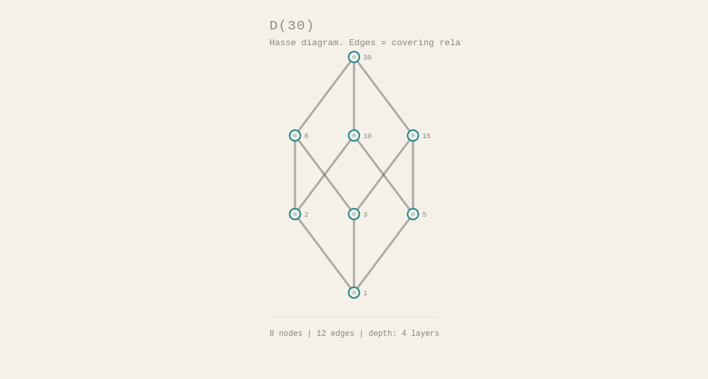
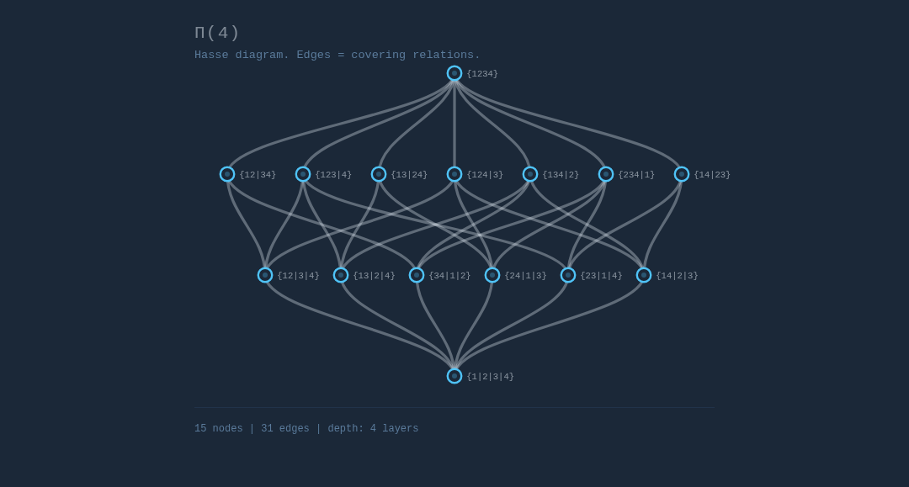
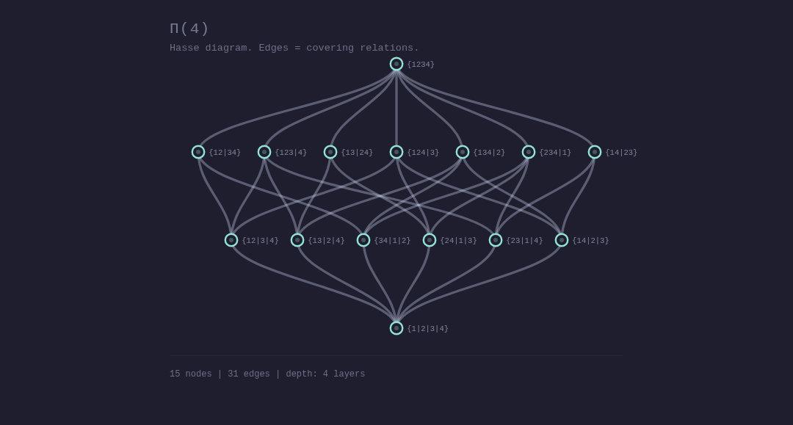

# dag-map

DAG visualization as metro maps. Decomposes directed acyclic graphs into routes (execution paths) and renders them with a transit-map aesthetic — colored lines for node classes, interchange stations for fan-in/fan-out nodes, and progressive angular or bezier curves for organic edge routing. No build step, no dependencies, raw ES modules.


## Demo

[**Metro map demo**](https://23min.github.io/DAG-map/demo/dag-map.html) — or open `demo/dag-map.html` directly in a browser. No server needed. Features:
- DAG selector (8 sample graphs of varying size and shape)
- Routing toggle (bezier / angular)
- Theme selector (6 built-in themes)
- Diagonal labels with angle slider
- Advanced section with layout parameter sliders
- Live code snippet showing current options, syntax-highlighted and copyable

[**Hasse diagram demo**](https://23min.github.io/DAG-map/demo/hasse.html) — or open `demo/hasse.html` directly. 13 example lattices and DAGs (Boolean lattice, divisibility, set inclusion, face lattice, and more), each with mathematical context. No server needed.

## Quick start

```javascript
import { dagMap } from 'dag-map';

const dag = {
  nodes: [
    { id: 'fetch', label: 'fetch', cls: 'side_effecting' },
    { id: 'parse', label: 'parse', cls: 'pure' },
    { id: 'analyze', label: 'analyze', cls: 'recordable' },
    { id: 'approve', label: 'approve', cls: 'gate' },
    { id: 'deploy', label: 'deploy', cls: 'side_effecting' },
  ],
  edges: [
    ['fetch', 'parse'], ['parse', 'analyze'],
    ['analyze', 'approve'], ['approve', 'deploy'],
  ],
};

const { layout, svg } = dagMap(dag);
document.getElementById('container').innerHTML = svg;
```

## API

### `dagMap(dag, options?)` — convenience function

Runs layout + render in one call. Returns `{ layout, svg }`.

### `layoutMetro(dag, options?)` — layout engine

Computes node positions, route paths, and edge geometry. Returns a layout object.

```javascript
import { layoutMetro } from 'dag-map';

const layout = layoutMetro(dag, {
  routing: 'bezier',        // 'bezier' (default) | 'angular'
  direction: 'ltr',         // 'ltr' (default) | 'ttb' (top-to-bottom)
  theme: 'cream',           // theme name or custom theme object
  scale: 1.5,               // global size multiplier (default: 1.5)
  layerSpacing: 38,         // px between topological layers (before scale)
  mainSpacing: 34,          // px between depth-1 branch lanes (before scale)
  subSpacing: 16,           // px between sub-branch lanes (before scale)
  progressivePower: 2.2,    // angular routing: curve aggressiveness (1.0–3.5)
  maxLanes: null,           // cap on lane count (null = unlimited)
});
```

### `renderSVG(dag, layout, options?)` — SVG renderer

Renders a layout into an SVG string.

```javascript
import { renderSVG } from 'dag-map';

const svg = renderSVG(dag, layout, {
  title: 'MY PIPELINE',     // title text at top of SVG
  diagonalLabels: false,     // tube-map style angled station labels
  labelAngle: 45,            // angle in degrees (0–90) when diagonalLabels is true
  showLegend: true,          // show legend at bottom
  cssVars: false,            // use CSS var() references instead of inline colors
  legendLabels: {            // custom legend text per class
    pure: 'Compute',
    recordable: 'AI/ML',
    side_effecting: 'I/O',
    gate: 'Approval',
  },
});
```

## Color modes

### Inline colors (default)

SVGs contain hardcoded hex colors. Portable — works in ``, email, Figma, PDF export, server-side rendering.

```javascript
renderSVG(dag, layout); // colors baked into the SVG
```

### CSS variables (opt-in)

SVGs reference CSS custom properties. Themeable from CSS — responds to `prefers-color-scheme`, hover effects, and runtime changes without re-rendering. Requires the SVG to be inline in the DOM (not ``).

```javascript
renderSVG(dag, layout, { cssVars: true });
```

The SVG output uses `var(--dm-paper)`, `var(--dm-cls-pure)`, etc. Override them in your stylesheet:

```css
/* Dark mode via CSS only — no JS re-render needed */
@media (prefers-color-scheme: dark) {
  :root {
    --dm-paper: #1E1E2E;
    --dm-ink: #CDD6F4;
    --dm-cls-pure: #94E2D5;
    --dm-cls-recordable: #F38BA8;
    --dm-cls-side-effecting: #F9E2AF;
    --dm-cls-gate: #EBA0AC;
  }
}
```

Default values for all CSS variables are provided in `dag-map.css` (metro layouts) and `hasse.css` (Hasse diagrams). Include the appropriate file for your use case — or both if using both layout engines.

## Routing styles

### Bezier (default)

Cubic bezier S-curves. Smooth, organic feel with adaptive control point spacing.

```javascript
layoutMetro(dag, { routing: 'bezier' });
```

### Angular (progressive)

Piecewise-linear curves with progressive steepening. Convergence edges (returning to trunk) start nearly flat and get steeper — like a ball rolling up a ramp. Divergence edges (departing from trunk) start steep and flatten out. Uses interchange-aware direction detection.


```javascript
layoutMetro(dag, { routing: 'angular', progressivePower: 2.2 });
```

The `progressivePower` parameter controls how aggressive the angle progression is:
- `1.0` — uniform angle (no progression, straight diagonal)
- `2.2` — default, natural-looking curve
- `3.5` — dramatic, very flat start then steep finish

## Hasse diagrams

`layoutHasse` renders lattices and partial orders using a Sugiyama-style layered layout. Where `layoutMetro` decomposes a DAG into routes (execution paths), `layoutHasse` treats every node as a point in a partial order — suitable for divisibility lattices, set inclusion, face lattices, concept lattices, and similar structures.

```javascript
import { layoutHasse, renderSVG } from 'dag-map';

const divisibility = {
  nodes: [
    { id: '1',  label: '1'  },
    { id: '2',  label: '2'  },
    { id: '3',  label: '3'  },
    { id: '6',  label: '6'  },
    { id: '12', label: '12' },
  ],
  // covering relations: [lesser, greater]
  edges: [['1','2'], ['1','3'], ['2','6'], ['3','6'], ['6','12']],
};

const layout = layoutHasse(divisibility, { theme: 'mono' });
const svg = renderSVG(divisibility, layout);
document.getElementById('container').innerHTML = svg;
```

Options:

| Parameter | Default | Description |
|-----------|---------|-------------|
| `theme` | `'mono'` | Theme name or custom theme object. Defaults to mono (clean for academic use). |
| `scale` | `1.5` | Global size multiplier. |
| `rankSpacing` | `80` | Vertical distance between layers (before scale). |
| `nodeSpacing` | `60` | Horizontal distance between nodes (before scale). |
| `edgeStyle` | `'bezier'` | `'bezier'` or `'straight'`. |
| `crossingPasses` | `24` | Barycenter sweep iterations for crossing reduction. |

Edges represent covering relations. By convention `[a, b]` means a is covered by b (a ≤ b, a lower in the diagram). See the [Hasse demo](https://23min.github.io/DAG-map/demo/hasse.html) for 13 worked examples.

| | |
|---|---|
|  |  |
| D(30) mono | D(30) cream |
|  |  |
| Π(4) blueprint | Π(4) dark |

## Theming

### Built-in themes

| Theme | Description |
|-------|-------------|
| `cream` | Warm cream paper, muted ink. Default. |
| `light` | Clean white, slightly bolder colors. |
| `dark` | Dark background, pastel routes (Catppuccin-inspired). |
| `blueprint` | Dark navy, bright engineering-drawing colors. |
| `mono` | Pure grayscale. For print and academic papers. |
| `metro` | Classic transit-map colors (bold red/blue/orange/purple on white). |

```javascript
layoutMetro(dag, { theme: 'dark' });
```

| | |
|---|---|
|  |  |
| dark | blueprint |
|  |  |
| metro | mono |

### Custom themes

Pass a theme object instead of a name. Any missing properties fall back to the `cream` defaults.

```javascript
const myTheme = {
  paper: '#1a1a2e',           // background color
  ink: '#e0e0e0',             // primary text color
  muted: '#888888',           // secondary text, legend
  border: '#333333',          // separator lines
  classes: {                  // one color per node class
    pure: '#00b4d8',
    recordable: '#ff6b6b',
    side_effecting: '#ffd93d',
    gate: '#6bcb77',
  },
  lineOpacity: 1.0,           // multiplier for route line opacity (default: 1.0)
};

layoutMetro(dag, { theme: myTheme });
```

### Theme properties

| Property | Type | Default | Description |
|----------|------|---------|-------------|
| `paper` | string | `'#F5F0E8'` | Background color |
| `ink` | string | `'#2C2C2C'` | Primary text and station stroke color |
| `muted` | string | `'#8C8680'` | Secondary text, legend labels |
| `border` | string | `'#D4CFC7'` | Separator lines, borders |
| `classes` | object | `{pure, recordable, side_effecting, gate}` | Color per node class (keyed by `cls` value) |
| `lineOpacity` | number | `1.0` | Multiplier for route line opacity. Values >1 make lines bolder (e.g. `1.4` for the metro theme). Clamped to max 1.0 per line. |

### Custom node classes

The default class names (`pure`, `recordable`, `side_effecting`, `gate`) are just string identifiers. You can use any names — just match them between your node `cls` values, your theme's `classes` keys, and your `legendLabels`:

```javascript
const dag = {
  nodes: [
    { id: 'a', label: 'ingest', cls: 'io' },
    { id: 'b', label: 'transform', cls: 'compute' },
    { id: 'c', label: 'review', cls: 'human' },
  ],
  edges: [['a', 'b'], ['b', 'c']],
};

layoutMetro(dag, {
  theme: {
    classes: { io: '#F5A623', compute: '#0078C8', human: '#6A2D8E' },
  },
});

renderSVG(dag, layout, {
  legendLabels: { io: 'I/O', compute: 'Compute', human: 'Human gate' },
});
```

## Layout parameters

These control the spatial structure of the graph. All spacing values are in px **before** the `scale` multiplier is applied.

| Parameter | Default | Effect |
|-----------|---------|--------|
| `scale` | `1.5` | Global size multiplier. Affects all spatial values and rendering sizes. |
| `direction` | `'ltr'` | Layout direction. `'ltr'` = left-to-right (default). `'ttb'` = top-to-bottom. |
| `layerSpacing` | `38` | Distance between topological layers (horizontal in LTR, vertical in TTB). |
| `mainSpacing` | `34` | Vertical distance between depth-1 branch lanes. Higher = routes fan further from trunk. |
| `subSpacing` | `16` | Vertical distance between sub-branch lanes. Higher = sub-branches spread more. |
| `maxLanes` | `null` | Maximum lane count. `null` = unlimited. Lower values force a more compact layout. |

## Docs

- [DAG Visualization Landscape](docs/research/dag-visualization-landscape.md) — research on layout approaches, scale considerations, dynamic DAGs, and domain precedents

### Reference design

The reference that defined the visual language — interchange stations, route coloring, and progressive angular curves:


## Contributing

Contributions welcome — bug fixes, layout improvements, new themes, demo examples, and docs. Scope is DAG visualization (metro-map style) and Hasse diagrams. See [CONTRIBUTING.md](CONTRIBUTING.md) for details.

## License

MIT
